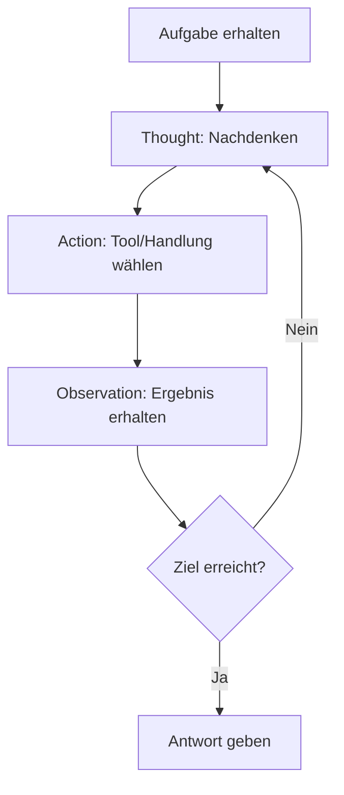

# ReAct - Reasoning and Acting

ReAct (Reasoning + Acting) ist ein Ansatz, der Large Language Models (LLMs) dazu befähigt, sowohl logisches Denken (Reasoning) als auch Handlungen (Acting) in einem integrierten Prozess auszuführen. Dabei kombiniert ReAct die Fähigkeit von LLMs, Argumentationsketten (#Chain-of-Thought) zu generieren, mit der Fähigkeit, aufgabenspezifische Aktionen auszuführen, wie z. B. Informationen abzurufen, APIs aufzurufen oder externe Tools zu verwenden.

## Ablauf

* Der Agent erhält eine Aufgabe.
* Er denkt nach ("Thought").
* Er entscheidet sich für eine Aktion ("Action").
* Er erhält ein Ergebnis ("Observation").
* Er wiederholt die Schritte, bis die Aufgabe gelöst ist.

## Hauptmerkmale von ReAct:
1. **Argumentationsspuren (Reasoning)**: Das Modell erklärt seine Gedankengänge, indem es Schritt-für-Schritt-Überlegungen generiert. Dies verbessert die Transparenz und Nachvollziehbarkeit der Entscheidungen.
2. **Handlungen (Acting)**: Neben der Argumentation führt das Modell konkrete Aktionen aus, z. B. das Abrufen von Informationen oder das Interagieren mit einer Umgebung.
3. **Verschachtelung**: ReAct kombiniert Denken und Handeln in einer verschachtelten Weise. Das Modell kann zwischen Argumentation und Aktion wechseln, um komplexe Aufgaben effizient zu lösen.

## Vorteile von ReAct:
- **Verbesserte Problemlösung**: Durch die Kombination von Denken und Handeln kann das Modell komplexe Aufgaben bewältigen, die reines Denken oder Handeln allein nicht lösen könnten.
- **Erklärbarkeit**: Die Argumentationsspuren machen die Entscheidungen des Modells nachvollziehbar.
- **Flexibilität**: ReAct kann in verschiedenen Anwendungsbereichen eingesetzt werden, z. B. in der Automatisierung, Entscheidungsfindung oder Interaktion mit externen Tools.

## Beispiel im `LangChain`-Umfeld:
Ein ReAct-Modell könnte eine Frage beantworten, indem es zunächst über die Frage nachdenkt, dann eine Suchmaschine abfragt, die Ergebnisse analysiert und schließlich eine fundierte Antwort liefert.